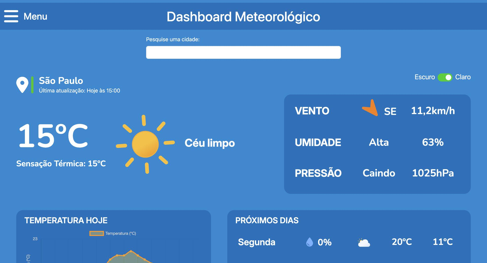
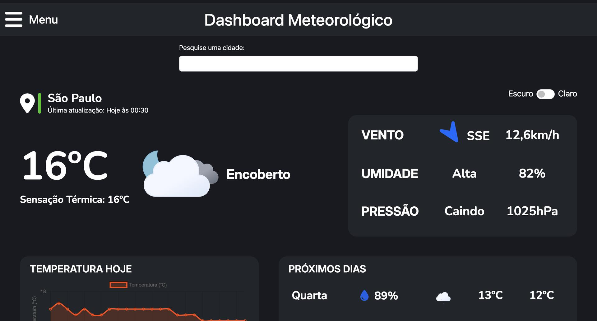

# Estação Meteorológica
Aplicação web em Django para consultar clima por cidade.
Exibe condições atuais, previsão, umidade, vento e gráfico horário com dados da WeatherAPI.

## Problema
Consultar o clima em sites e apps genéricos costuma exigir navegação extra e nem sempre entrega uma visão clara do que interessa no dia a dia.
Este projeto centraliza a consulta meteorológica em uma única tela, com informações objetivas e leitura rápida.

## Solução
Foi construída um dashboard meteorológica com Django que consulta a WeatherAPI, trata os dados retornados e apresenta tudo em uma interface responsiva.
O usuário pode buscar uma cidade, ver o clima atual, acompanhar a previsão e navegar por cidades cadastradas no banco para facilitar novas consultas.

## Funcionalidades
- Consulta de clima por cidade via parâmetro `local` na URL.
- Cidade padrão `São Paulo` quando nenhuma busca é informada.
- Exibição de temperatura atual, sensação térmica, condição do tempo, vento, umidade e pressão.
- Gráfico com a temperatura hora a hora do dia atual.
- Previsão resumida do dia atual e dos próximos dias retornados pela API.
- Autocomplete com cidades cadastradas no banco.
- Alternância visual entre tema claro e escuro.
- Página específica para cidade inexistente e páginas de erro HTTP.
- Área administrativa do Django para gerenciar cidades.

## Tecnologias
- Django 5.2
- Python
- WeatherAPI
- SQLite
- `python-decouple`
- `requests`
- `pytz`
- Bootstrap 5
- `django-bootstrap5`
- Chart.js
- Gunicorn
- Nginx
- WhiteNoise
- Docker
- Docker Compose

## Arquitetura
Fluxo principal:

```text
Usuário -> Django View -> WeatherAPI -> JSON com clima e previsão
                |             
                v
        Tratamento dos dados
                v
      Template HTML + Bootstrap + Chart.js
                v
            Navegador
```

Detalhes relevantes:
- A rota raiz (`/`) chama `IndexView`.
- A view lê a chave da API via `.env`.
- A cidade pode vir por `?local=...` ou usar o padrão `São Paulo`.
- Se a cidade não for encontrada pela WeatherAPI, a aplicação renderiza `local_inexistente.html`.
- O projeto usa SQLite localmente e Nginx + Gunicorn no cenário com Docker.

## Como rodar

### Pré-requisitos
- Python 3.11 ou superior.
- Chave de API da WeatherAPI.
- Docker e Docker Compose, se quiser usar containers.

### Instalação local

```bash
python3 -m venv venv
source venv/bin/activate
pip install -r requirements.txt
python manage.py migrate
python manage.py runserver
```

Windows PowerShell:

```powershell
python -m venv venv
venv\Scripts\Activate.ps1
pip install -r requirements.txt
python manage.py migrate
python manage.py runserver
```

### Com Docker

```bash
docker compose build
docker compose up -d
docker compose exec web python manage.py migrate
docker compose exec web python manage.py collectstatic --noinput
```

A aplicação fica disponível em `http://127.0.0.1:8000/` no modo local e em `http://localhost/` com Docker.

## Variáveis de ambiente
Use o arquivo `.env.example` como base e crie um `.env` na raiz do projeto.

```env
SECRET_KEY='sua-chave-secreta'
DEBUG=True
API_KEY='sua-chave-da-weatherapi'
```

Observações:
- `SECRET_KEY` é obrigatória para o Django.
- `DEBUG` deve ficar `False` em produção.
- `API_KEY` é a chave da WeatherAPI usada nas requisições.

## Prints
O website ainda não possui responsividade para dispositivos mobile, então ambos os prints atuais são da tela tipo Desktop.

### Tela com tema claro


### Tela com tema escuro


## Decisões técnicas
- A WeatherAPI foi usada porque entrega clima atual, previsão e metadados da cidade em uma única resposta.
- `python-decouple` centraliza as configurações sensíveis no `.env` e evita segredo no código.
- SQLite foi mantido porque o projeto é simples e fica fácil de executar localmente.
- `requests` foi suficiente para o consumo da API externa, sem adicionar complexidade desnecessária.
- `pytz` foi usado para converter o horário da estação para UTC com base no fuso retornado pela API.
- `WhiteNoise` simplifica o uso de arquivos estáticos em ambientes menores e no container.
- `Gunicorn` e `Nginx` foram escolhidos para separar a aplicação Python do proxy reverso no deploy.

Limitações atuais:
- A aplicação depende da disponibilidade e do formato da WeatherAPI.
- O projeto ainda usa SQLite, então não está otimizado para cenários com múltiplos usuários concorrentes.
- O tratamento de falhas de rede e de rate limit da API ainda é básico.

## Melhorias futuras
- Adicionar cache das respostas da WeatherAPI para reduzir chamadas repetidas.
- Melhorar o tratamento de erros de rede, timeout e limite de requisições.
- Criar testes automatizados para a view principal e para cenários de cidade inválida.
- Expandir a busca para aceitar mais variações de nome de cidade.
- Adicionar diferentes tipos de cor de fundo a depender do horário do dia e modo selecionado (claro/escuro)
- Adicionar responsividade ao projeto
